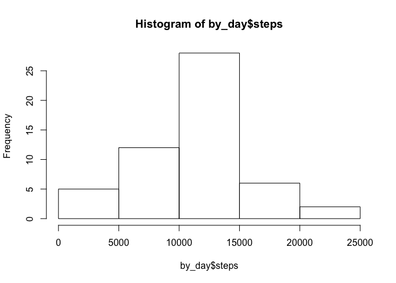
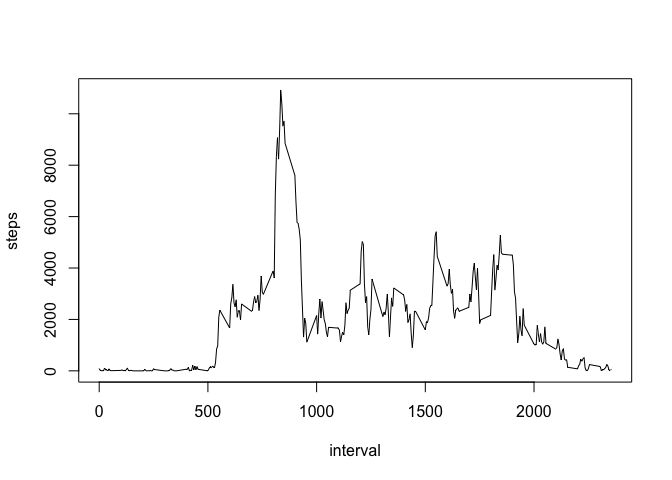
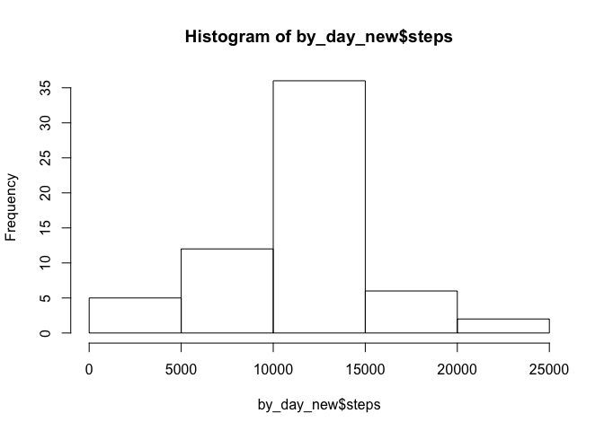
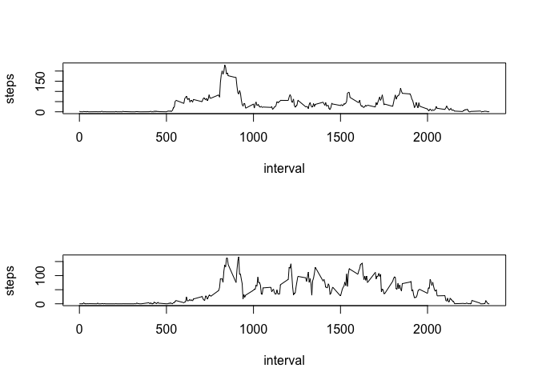

# Reproducible Research: Peer Assessment 1


## Loading and preprocessing the data

```r
unzip("activity.zip")
```


## What is mean total number of steps taken per day?

```r
csv <- read.csv("activity.csv")
csv_clean = csv[! is.na(csv$steps),]
```

## What is the average daily activity pattern?

```r
by_day <- aggregate(steps~date, data=csv_clean, FUN="sum")
by_interval <- aggregate(steps~interval, data = csv_clean, FUN="sum")
hist(by_day$steps)
```

<!-- -->


```r
median(by_day$steps, na.rm=TRUE)
```

```
## [1] 10765
```


```r
mean(by_day$steps, na.rm=TRUE)
```

```
## [1] 10766.19
```


```r
plot(by_interval, type = "l")
```

<!-- -->


```r
by_interval[by_interval$steps == max(by_interval$steps),]
```

```
##     interval steps
## 104      835 10927
```


## Inputing missing values

```r
sum(is.na(csv$steps))
```

```
## [1] 2304
```


```r
by_interval_mean <- aggregate(steps~interval, data = csv_clean, FUN="mean")
na_rows <- which(is.na(csv$steps) == TRUE)
csv_new <- csv
for (row in na_rows) {
  csv_new[row,"steps"] <- by_interval_mean[by_interval_mean$interval == csv_new[row,]$interval, ]$steps
}
```


```r
by_day_new <- aggregate(steps~date, data=csv_new, FUN="sum")
hist(by_day_new$steps)
```

<!-- -->


```r
median(by_day_new$steps, na.rm=TRUE)
```

```
## [1] 10766.19
```


```r
mean(by_day_new$steps, na.rm=TRUE)
```

```
## [1] 10766.19
```

## Are there differences in activity patterns between weekdays and weekends?

```r
csv_new$day <- weekdays(as.Date(csv_new$date, format = "%Y-%m-%d"))
csv_new[csv_new$day == "Monday" | csv_new$day == "Tuesday" | csv_new$day == "Wednesday" | csv_new$day == "Thursday" | csv_new$day == "Friday", "day"] <- "weekday"
csv_new[csv_new$day == "Saturday" | csv_new$day == "Sunday" , "day"] <- "weekend"
```


```r
par(mfrow=c(2,1))
plot(aggregate(steps~interval, data=csv_new[csv_new$day == "weekday",], FUN="mean"), type = "l")
plot(aggregate(steps~interval, data=csv_new[csv_new$day == "weekend",], FUN="mean"), type = "l")
```

<!-- -->


